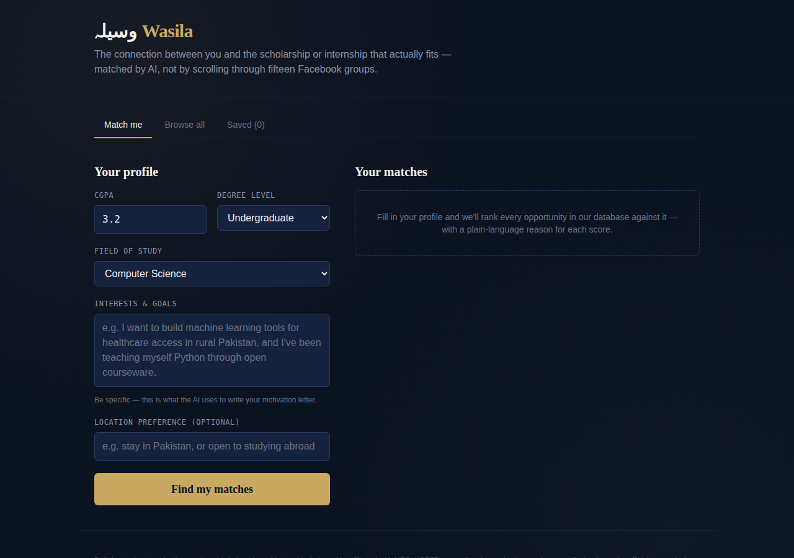
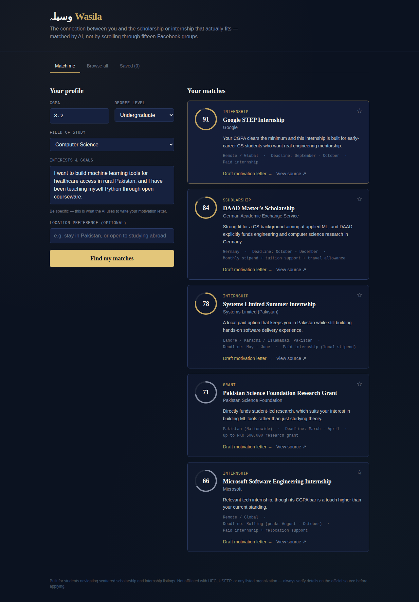
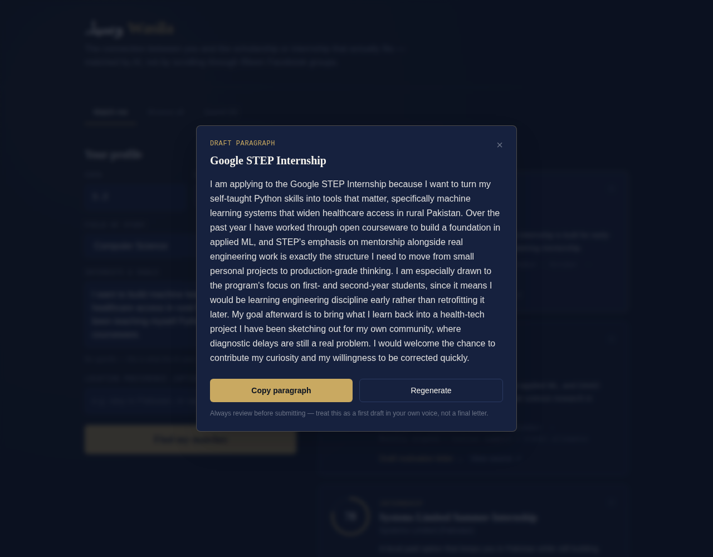
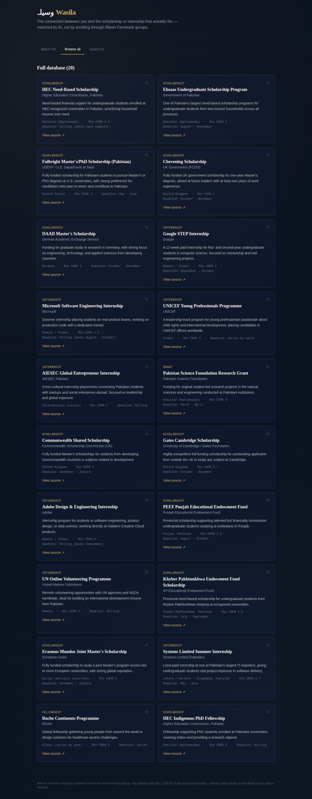

# Wasila (وسیلہ) — the connection between you and the opportunity that fits

[](https://wasila-ai-app.vercel.app/)
[](https://groq.com)
[](https://nextjs.org)
[](https://tailwindcss.com)

**Wasila** is an AI-powered scholarship and internship matcher built for students who are tired of scrolling through a dozen scattered Facebook groups, WhatsApp forwards, and outdated PDFs to find opportunities they're actually eligible for. You give Wasila your CGPA, degree level, field, and a short description of your interests — it ranks a curated database of scholarships, internships, grants, and fellowships against your profile, explains *why* each one fits, and drafts a tailored motivation-letter paragraph for your best match.

The name comes from the Urdu/Arabic word **وسیلہ (wasila)** — "the means" or "the connection" — which is exactly what the app tries to be between a student and their next opportunity.

## Who this is for

Undergraduate and graduate students — in Pakistan especially, but the matcher works for any student — who don't have the time or institutional connections to manually track every scholarship deadline, internship posting, and eligibility requirement across dozens of organizations. It's built from a problem I've personally run into: relevant opportunities exist, but they're scattered, and by the time you hear about one from a friend, the deadline has often passed.

## Live app

🔗 **[https://wasila-ai-app.vercel.app/](https://wasila-ai-app.vercel.app/)**

## Features

- **AI matching engine** — ranks every opportunity in the database (0–100) against your profile, with a specific, non-generic one-sentence explanation for each score
- **AI-drafted motivation letters** — generates a tailored 120–180 word paragraph for any opportunity, written in first person, referencing your actual stated interests (never invents achievements you didn't mention)
- **Regenerate on demand** — not happy with a draft? Regenerate it, or request a letter for a different opportunity entirely
- **Browse the full curated database** — 20 real scholarships, internships, grants, and fellowships (HEC, Ehsaas, Fulbright, Chevening, DAAD, Commonwealth, Gates Cambridge, Erasmus Mundus, Google STEP, Microsoft, Adobe, UNICEF, AIESEC, and more), searchable independent of the matcher
- **Save opportunities** — star any opportunity to keep it in a personal shortlist (persisted locally in your browser)
- **Copy-to-clipboard** for drafted letters, ready to paste and personalize further
- Fully responsive, keyboard-accessible, dark academic-themed UI

## The AI feature

Wasila's AI feature has two parts, both powered by [Groq](https://groq.com)'s free, fast inference API running **Llama 3.3 70B**. Groq was chosen over other providers for two practical reasons: its free tier has generous rate limits (well suited to repeated grading/testing without hitting quota errors), and its inference speed keeps the matching step feeling instant instead of making the user wait several seconds per request.

### 1. Matching engine (`/api/match`)

Given a student's profile and the candidate opportunity list, the model scores **every** opportunity, explains its reasoning in one specific sentence (not generic filler), and identifies the single best match. This is the system prompt that drives it:

```
You are the matching engine inside Wasila, an app that helps students in Pakistan (and applicants worldwide) find scholarships and internships that genuinely fit their situation.

You will receive:
1. A student's profile: CGPA, degree level, field of study, a free-text description of their interests/goals, and a location preference.
2. A JSON array of candidate opportunities (scholarships, internships, grants, fellowships), each with an id, title, field(s), degree level(s), minimum CGPA, location, and description.

Your job:
1. Score EVERY candidate opportunity from 0-100 for how well it fits this specific student. Consider: field alignment, degree level match, whether their CGPA clears the minimum (a CGPA below the minimum should score low, not zero, since some programs are flexible), location preference, and whether the free-text interests genuinely connect to what the opportunity offers.
2. Write a ONE-SENTENCE, specific reason for each score. Do not write generic filler like "this is a good match" — name the actual overlapping factor (e.g. "Your CGPA and CS background exceed the minimum, and this internship's remote format fits your preference to stay in Pakistan").
3. Identify the single best match (highest score).
4. Write a tailored motivation letter PARAGRAPH (120-180 words) for that best match, written in the first person as if the student wrote it. It must:
   - Reference the specific opportunity by name and organization.
   - Reference at least one concrete detail from the student's stated interests or field.
   - Sound like a genuine, specific student voice — not a generic template. Avoid clichés like "I have always been passionate about" or "I am writing to express my interest."
   - Be honest and grounded — never invent achievements, awards, or experiences the student did not mention.
   - End on a forward-looking, concrete note (what they hope to contribute or learn), not a vague closing line.

Respond with ONLY valid JSON, no markdown fences, no preamble, no explanation outside the JSON, in exactly this shape:
{
  "matches": [{"id": "opportunity-id", "score": 0-100, "reasoning": "one sentence"}],
  "letter": {"opportunityId": "id-of-best-match", "paragraph": "the paragraph text"}
}

Include a "matches" entry for every opportunity you were given, sorted by score descending.
```

### 2. Letter drafting (`/api/letter`)

Lets the student request a fresh, tailored motivation-letter paragraph for *any* opportunity in the results (not just the top match), or regenerate a draft they don't like:

```
You are Wasila's motivation-letter assistant. Given a student's profile and ONE specific opportunity (scholarship or internship), write a single tailored motivation-letter paragraph (120-180 words) in the first person, as if the student wrote it themselves.

Rules:
- Reference the opportunity by name and organization.
- Reference at least one concrete detail from the student's stated field or interests.
- Never invent achievements, awards, GPAs, or experiences the student did not mention.
- Avoid clichés ("I have always been passionate about...", "I am writing to express my interest...").
- End with a specific, forward-looking sentence about what the student hopes to contribute or learn.

Respond with ONLY valid JSON, no markdown fences, in exactly this shape:
{"paragraph": "the paragraph text"}
```

Both prompts are in [`lib/ai.ts`](./lib/ai.ts).

## Tools, services, and AI models used to build it

- **Framework:** Next.js 14 (App Router) + TypeScript, React
- **Styling:** Tailwind CSS with a custom design system (navy/gold "academic seal" palette, Fraunces + Inter + JetBrains Mono typefaces)
- **AI model:** Llama 3.3 70B via the [Groq API](https://console.groq.com/docs) (plain `fetch`, OpenAI-compatible chat completions endpoint — no extra SDK dependency)
- **Data:** a hand-curated static JSON database of 20 real scholarships/internships/grants (no external scraping — chosen deliberately to keep the project scoped and reliable)
- **Hosting:** Vercel (recommended) — any Node-compatible host works
- **Built with the help of:** Claude (Anthropic), used as a pair-programmer for scaffolding, design, and copywriting throughout this project

## Screenshots

**1. Profile form — tell Wasila about yourself**


**2. AI match results — every opportunity scored with a plain-language reason**


**3. AI-drafted motivation letter for the top match**


**4. Browse the full curated database independent of matching**


## How to run this project

### 1. Get a free Groq API key
Sign up at [console.groq.com](https://console.groq.com/keys), create an API key, and keep it handy. Groq's free tier is generous and fast enough for repeated testing. **Never commit this key to GitHub.**

### 2. Run locally
```bash
git clone https://github.com/<your-username>/wasila.git
cd wasila
npm install
cp .env.example .env.local
# open .env.local and paste your key:
# GROQ_API_KEY=gsk_...
npm run dev
```
Open [http://localhost:3000](http://localhost:3000).

### 3. Deploy to Vercel (free)
1. Push this repo to your own **public** GitHub account.
2. Go to [vercel.com](https://vercel.com), sign in with GitHub, and click **Add New → Project**.
3. Import your `wasila` repo.
4. Under **Environment Variables**, add:
   - `GROQ_API_KEY` = your key from step 1
5. Click **Deploy**. Vercel will give you a public URL like `https://wasila-yourname.vercel.app` — paste that into the [Live app](#live-app) section above.

### Project structure
```
app/
  page.tsx              — main UI (tabs: match / browse / saved)
  api/match/route.ts     — AI matching endpoint
  api/letter/route.ts    — AI letter-drafting endpoint
  layout.tsx, globals.css
components/               — ProfileForm, MatchCard, SealScore, LetterPanel, BrowseCard
lib/
  ai.ts                  — Groq client (fetch-based) + both system prompts
  types.ts, useSaved.ts
data/opportunities.json   — curated database (20 entries)
```

## Notes and limitations

- The opportunity database is a hand-curated static list for this project, not a live scraper — deadlines and details should always be verified on the official source (linked on every card).
- Saved/bookmarked opportunities are stored in the browser's `localStorage`, so they're per-device, not synced to an account (no login system was built, by design, to keep the scope focused on the AI matching feature).
- This tool drafts a *first draft* of a motivation-letter paragraph — students should always review, personalize, and fact-check before submitting anything.

---

## Author

**Muhammad Shariq Naseer**  
Final Project — Generative AI Course

- 📧 shariqmuhammad478@gmail.com  
- 🔗 https://github.com/shariqmuhammad478-commits
- 💼 https://www.linkedin.com/in/muhammad-shariq-8696543b7?utm_source=share_via&utm_content=profile&utm_medium=member_android

*Wasila was built end-to-end as an individual project — idea, design, code, and deployment — to solve a real problem I've personally faced while searching for scholarships and internships.*
